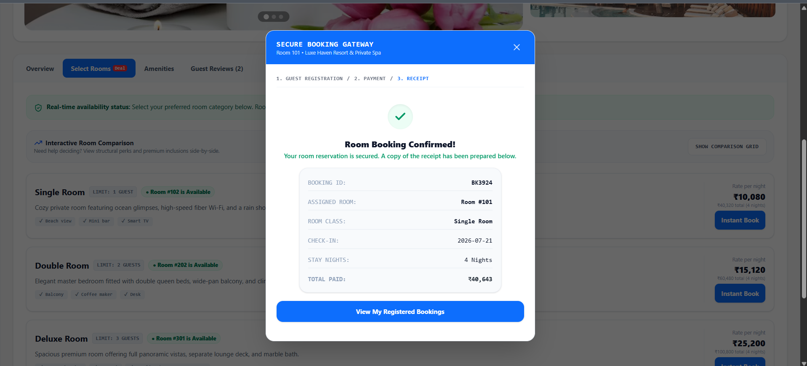

# LuxeHaven Travel App 🏨✨

A comprehensive, industry-oriented portfolio application that masterfully bridges the gap between a high-end, consumer-facing mainstream travel portal and a robust, object-oriented Java SE backend. 

This project was engineered to demonstrate a **Unified State Architecture**. Every interaction—from browsing beachfront villas to canceling a reservation—triggered in the sleek visual portal is instantly synchronized and processed through a simulated Java Virtual Machine (JVM) backend. It serves as both a functional travel booking engine and an interactive developer portfolio.

---

## 📑 Table of Contents
1. [Vision & Architecture](#-vision--architecture)
2. [Core Features & UI/UX](#-core-features--uiux)
3. [Developer Portfolio Suite (Java SE)](#-developer-portfolio-suite-java-se)
4. [Application Gallery](#-application-gallery)
5. [Installation & Local Setup](#-installation--local-setup)
6. [About the Developer](#-about-the-developer)

---

## 🏗️ Vision & Architecture

LuxeHaven was designed with a dual purpose: to provide an elite, frictionless user experience akin to top-tier travel platforms (like Booking.com or Airbnb) while acting as a transparent window into core backend logic. 

**Technical Highlights:**
* **Frontend Presentation:** Built with React, TypeScript, and Vite, utilizing a highly polished, premium color palette (`#F5F5F5` background, `#FFFFFF` shadow cards, `#0D6EFD` primary blue).
* **Backend Simulation (Virtual JVM):** A state-managed backend engine that enforces core Object-Oriented Programming (OOP) principles—Encapsulation, Inheritance, Polymorphism, and Abstraction. 
* **State Synchronization:** The consumer app and the developer console share a unified memory pool. A room booked in the UI instantly occupies the corresponding Java object instance in the backend.

---

## 🌟 Core Features & UI/UX

### 1. High-Fidelity Search & Filtering
* **Dynamic Search Module:** Users can select destinations, input specific check-in/check-out dates with an interactive calendar, and define guest counts.
* **Reactive Filter Engine:** Interactive filter chips allow users to instantly narrow down active stay listings by attributes like **Free Cancellation**, **Beachfront Location**, and **Breakfast Included**.
* **Intelligent Reset:** Filters automatically clear and reset when initiating a fresh search or clicking on "Popular Nearby Destinations" to prevent null result sets.

### 2. Immersive Property Details
* **Destination Climate & Packing Advisor:** A bespoke widget that dynamically calculates the local weather forecast based on the hotel's city and generates a curated, smart packing list (e.g., breathable linens for Goa, compact umbrellas for Mumbai).
* **Interactive Room Comparison Matrix:** A toggleable side-by-side grid allowing guests to evaluate room capacities, structural perks, bathroom specifications, and premium inclusions before booking.
* **Verified Reviews & Sentiment Dashboard:** Visual star distribution progress bars (Excellent, Good, Fair) with clickable buckets for dynamic filtering. Includes a verified positive keyword cloud highlighting recurring premium aspects (e.g., "Exemplary Staff", "Pristine Cleanliness").

### 3. Secure Checkout & Privilege Wallet
* **Constraint Enforcement:** The checkout wizard strictly enforces booking dates, guest limits, and real-time inventory allocation.
* **Interactive Privilege Wallet:** A click-to-apply voucher system that eliminates manual code entry. Supports tiered discounts (`HAVEN20` for 20% off, `JAVAOOP10` for 10% off) with instantaneous cart, GST, and total sum recalculations.
* **Sleek Credit Card Preview:** A beautifully crafted CSS credit card component that dynamically updates in real-time as the user enters their mock billing details over a simulated secure SSL terminal.
* **Stylized Transaction Receipt:** Generates a professional booking confirmation slip with randomized, tracked booking IDs.

---

## ☕ Developer Portfolio Suite (Java SE)

By toggling the "Developer View", the application transforms into an interactive technical showcase:
* **Interactive JVM Terminal:** Watch real-time execution logs from `Main.java` as bookings are processed through the consumer app.
* **OOP Code Explorer:** Inspect production-ready, Maven-compliant Java code including `BookingService.java` and `FileHandler.java`. Showcases structured exception handling and type safety.
* **Architecture Diagrams:** Access structural UML flow diagrams depicting the 3-tier presentation, service, and data-access layering.
* **AI Interview Mentor:** An integrated terminal simulator designed to drill technical Java and OOP interview questions.

---

## 📸 Application Gallery


*The Home Screen featuring a comprehensive search module, recent searches, and popular nearby destinations.*


*Search results showcasing interactive filtering chips for Free Cancellation, Beachfront Location, and Breakfast.*


*The Property Overview tab highlighting the Destination Climate & Packing Advisor for tailored travel preparation.*


*Real-time room availability status with the toggleable side-by-side room comparison matrix.*


*A comprehensive, icon-matched amenities and services grid for luxury properties.*


*Guest feedback dashboard featuring score distribution bars, sentiment keyword tags, and individual reviews.*


*Step 1 of the Secure Booking Gateway: Primary guest registration and contact details.*


*The Privilege Club wallet applying dynamic discounts with real-time tax and total recalculations.*


*Step 2: Sleek, dynamically updating credit card preview during secure payment entry.*


*Step 3: Final stylized transaction receipt and secured room confirmation.*

---

## 🚀 Installation & Local Setup

### Prerequisites
* **Node.js**: Version 18 or newer (LTS recommended). Download from [nodejs.org](https://nodejs.org/).
* **Git**: To clone the repository (if not downloading directly via ZIP).

### 1. Install Dependencies
Open your terminal, navigate to the extracted project directory, and run:
```bash
npm install
```

### 2. Start the Local Development Server
Launch the hybrid Vite + Express server environment with live-reloads:
```bash
npm run dev
```
Once booted, open your web browser and navigate to: **http://localhost:3000**

### 3. Compile & Run in Production Mode
To package and run the optimized full-stack application:
```bash
# Bundles client static assets and compiles the backend Express server
npm run build

# Runs the compiled CommonJS server bundle from /dist
npm start
```

---

## 👩‍💻 About the Developer

**Jui Ramteke**

GitHub:

https://github.com/Jui-Ramteke

Linkedin:

https://www.linkedin.com/in/jui-ramteke/

Instagram:

https://www.instagram.com/jui_ramteke_/
